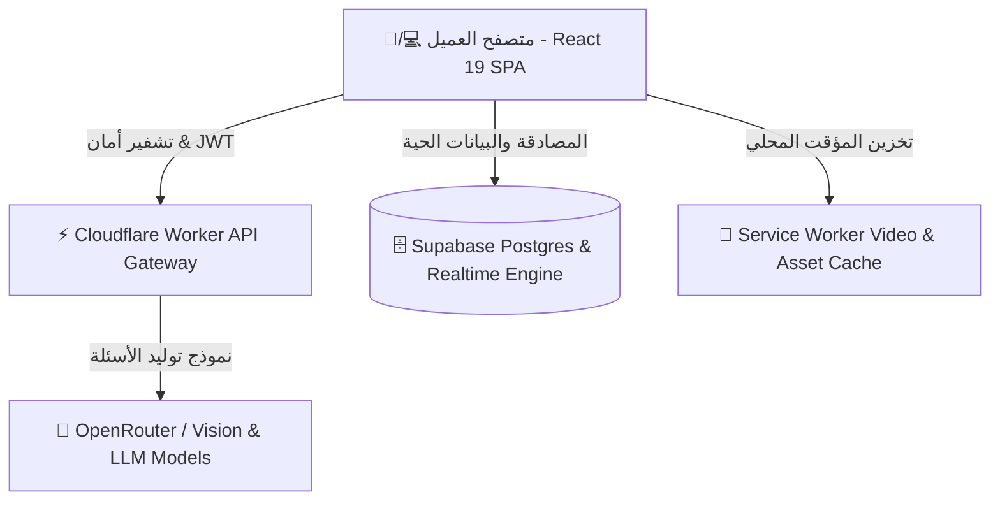

<div align="center">

# 🪐 QUIZ SPACE
### منصة الاختبارات التفاعلية والتعلم الذكي بالذكاء الاصطناعي التوليدي

<p align="center">
  <b>اصنع • اختبر • تنافس • تعلّم</b><br>
  منصة تعليمية سحابية متكاملة تجمع بين قوة الذكاء الاصطناعي (AI)، عناصر الألعاب التنافسية (Gamification)، والفصول الدراسية التفاعلية.
</p>

[](https://react.dev)
[](https://www.typescriptlang.org)
[](https://vitejs.dev)
[](https://tailwindcss.com)
[](https://supabase.com)
[](https://workers.cloudflare.com)
[](#-الرخصة)

</div>

---

## ✨ رؤية المنصة (Why QuizSpace?)

لم نقم بإنشاء **QuizSpace** لتكون مجرد أداة لإدخال الأسئلة والإجابة عليها، بل لتكون بيئة أكاديمية متكاملة تُحوّل الدراسة إلى تجربة ممتعة وتفاعلية:

- 🤖 **توليد فوري للأسئلة**: تحويل المحاضرات، الكتب الدراسية، وملفات الـ PDF أو الصور إلى اختبارات تفاعلية في ثوانٍ معدودة.
- ⚡ **معالجة موازية فائقة السرعة**: تحليل المستندات المتعددة الصفحات عبر تقنية Parallel Batching السحابية دون إجهاد الجهاز.
- 🏫 **فصول دراسية حية (Classrooms)**: التواصل المباشر بين المعلم والطلاب، مشاركة الواجبات، ولوحات متصدرين خاصة.
- 🎮 **نظام تحفيزي متكامل**: شارات توثيق ملكية، نقاط خبرة (XP)، مستويات مخصصة، وتحديات يومية متجددة.

---

## 🌟 المميزات الرئيسية

### 🎯 استوديو الذكاء الاصطناعي وصناعة الاختبارات
* **توليد متعدد الوسائط**: إنشاء أسئلة من النص المباشر، المواضيع الأكاديمية، أو عبر رفع صور وملفات PDF.
* **تمييز ذكي لأنواع الأسئلة**: التعرف التلقائي والفصل بين الأسئلة الاختيارية (`MCQ`)، الصح والخطأ (`True/False`)، والأسئلة المقالية (`Essay`).
* **تحليل الصور والرسومات البيانية**: استخراج وتضمين وصف التوضيحات البصرية الملحقة بالأسئلة تلقائياً.
* **حفظ المسودات التلقائي**: حفظ غير مرئي للمسودة لمنع ضياع أي محتوى أثناء انقطاع الاتصال أو الخروج الخاطئ.

### 🤖 كوزمو (Cosmo) — المساعد الأكاديمي الشخصي
* شات بوت ذكي متمرس في شرح المناهج وتفكيك المسائل الأكاديمية الصعبة.
* يدعم رؤية الكمبيوتر (Computer Vision) لتحليل ورقات الإجابة والرسومات الرسمية.
* محادثات محفوظة بشكل دائم ومؤمنة سحابياً.

### 🎥 تجربة بصريات فضائية سينمائية
* شاشات سبلاش تفاعلية متجاوبة ذاتياً مع أجهزة الديسكتوب والهواتف المحمولة (`splash-desktop` & `splash-mobile`).
* تخزين سحابي محلي متقدم (Service Worker Cache-First) للوسائط لتشغيل خاطف وبدون استهلاك للبيانات.

---

## 🏗️ البنية المعمارية للنظام (Architecture)



> 🔒 **الأمان العالي**: جميع مفاتيح الـ API الحساسة محفوظة داخل بيئة Cloudflare المعزولة ولا يتم كشفها إطلاقاً لمتصفح المستخدم.

---

## 🛠️ تقنيات المشروع (Tech Stack)

| النطاق | التقنيات المستخدمة |
| :--- | :--- |
| **الواجهة الأمامية** | React 19 • TypeScript • Vite 6 • Tailwind CSS v4 |
| **التأثيرات والأنيميشن** | GSAP • Canvas Confetti • Lucide Icons |
| **قاعدة البيانات والتشفير** | Supabase Postgres • Row Level Security (RLS) • E2EE Chat |
| **الذكاء الاصطناعي** | OpenRouter (Gemma 4 / Nemotron / Llama 3.3) • Cloudflare Workers |
| **الأداء والكاش** | Custom Service Worker PWA Engine • Vite Immutable Caching |

---

## 🚀 التشغيل والتطوير المحلي (Getting Started)

### المتطلبات الأساسية
- **Node.js** إصدار `v20.0.0` أو أحدث.
- **npm** أو **pnpm**.

### 1. استنساخ المشروع وتثبيت الحزم
```bash
git clone https://github.com/your-username/quiz-space.git
cd quiz-space
npm install
```

### 2. إعداد متغيرات البيئة (`.env`)
قم بأنشأ ملف `.env` في المجلد الرئيسي وإضافة البيانات التالية:
```env
VITE_SUPABASE_URL=https://your-supabase-url.supabase.co
VITE_SUPABASE_ANON_KEY=your-supabase-anon-key
VITE_AI_WORKER_URL=http://localhost:8787
```

### 3. تشغيل خادم التطوير
```bash
npm run dev
```

### 4. تشغيل خادم الذكاء الاصطناعي (Cloudflare Worker)
```bash
cd worker
npm install
npx wrangler dev
```

---

## 📄 الرخصة (License)

المشروع مرخص تحت رخصة **MIT** المفتوحة المصدر.

---

<div align="center">

**تم التطوير بحب وشغف لتقديم أفضل تجربة تعليمية متميزة 🚀**

</div>
